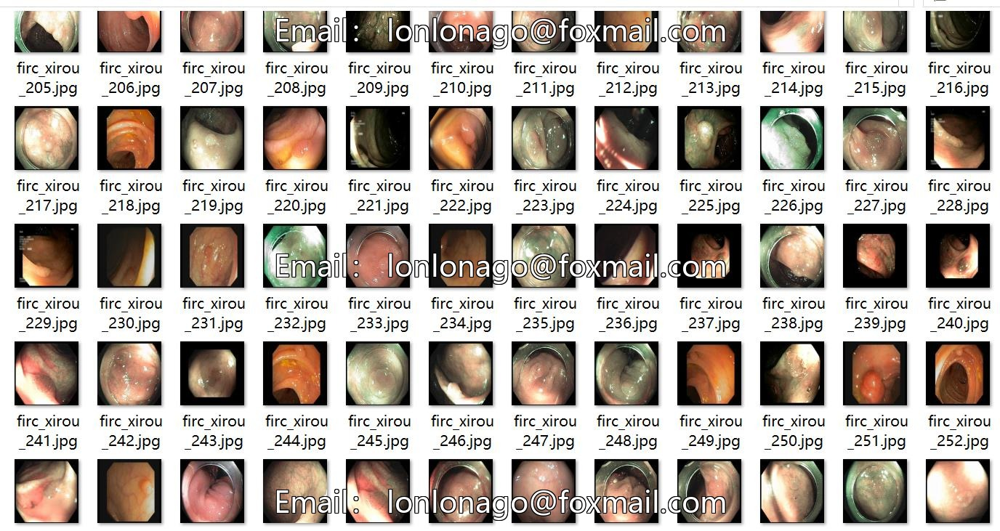
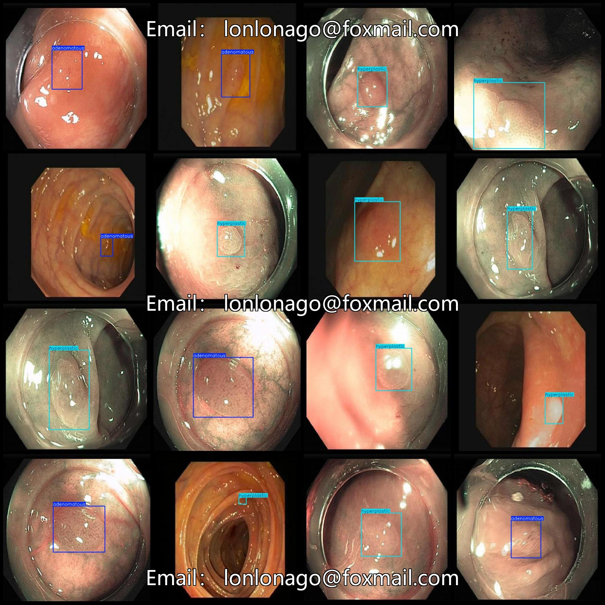

# Vision and Operations for Medical Applications (VOC+YOLO) dataset in the format of 9263 images with 2 categories

Dataset format: Pascal VOC format + YOLO format (txt file without split paths, only containing jpg images and corresponding VOC format xml files and YOLO format txt files)
Number of images (jpg file count): 9263
Number of annotations (xml file count): 9263
Number of annotations (txt file count): 9263
Number of annotation categories: 2
Annotation category names (notice that the order of categories in the YOLO format does not correspond to this, but is based on the labels folder 'classes.txt'): ["adenomatous", "hyperplastic"]
Number of bounding boxes per category:
adenomatous (adenomatous polyps) bounding box count = 4933
hyperplastic (proliferative polyps) bounding box count = 4332
Total bounding box count: 9265
Image resolution: 640x640
Annotation tool used: labelImg
Annotation rules: draw bounding boxes for each category
Important note: No guarantees are made regarding the accuracy of the trained models or weight files.
Image preview:
## Images

Here is a pay link on Stripe ( https://buy.stripe.com/3cs8yP7sY87d0vu9AB ). Please contact me lonlonago@foxmail.com after funding $89, and I will send you a complete data files , thank you!

